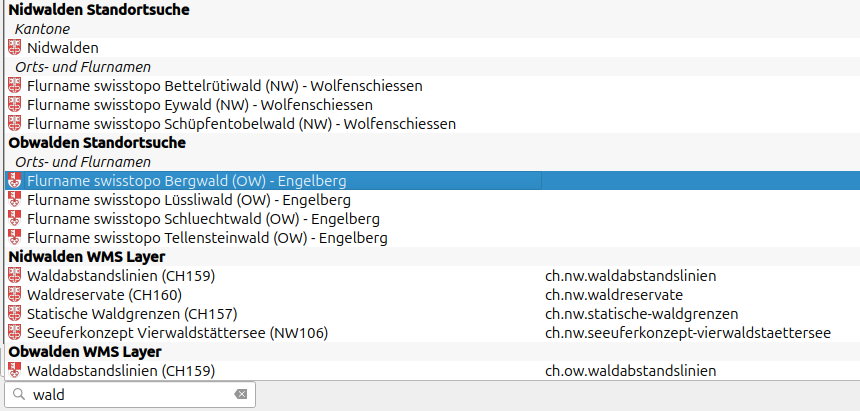
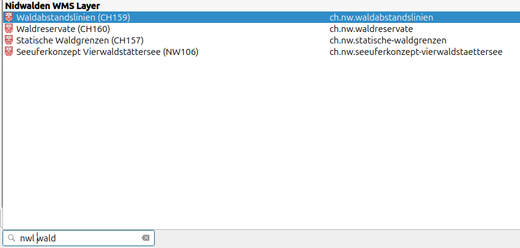
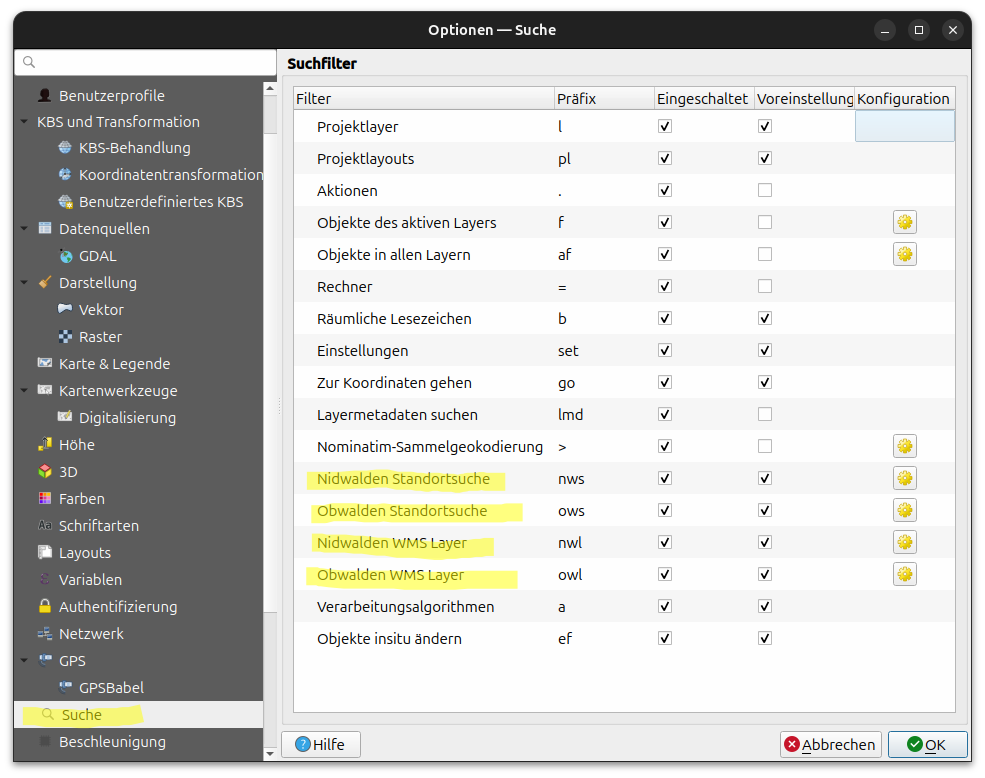
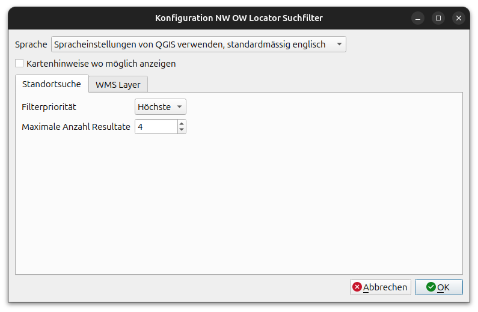

# NW OW Locator – QGIS Plugin

[](https://github.com/psf/black)
[](https://pycqa.github.io/isort/)
[](https://github.com/pre-commit/pre-commit)
[](https://flake8.pycqa.org/)


A QGIS locator integration to search for layers, addresses and other objects in Swiss cantons Nidwalden (NW) and Obwalden (OW).

## Features
Search for:
- WMS layers from the official [NW](https://www.gis-daten.ch/wms/nw/service) and [OW](https://www.gis-daten.ch/wms/ow/service) WMS services
- Places, municipalities, addresses, parcels and public transport stops, powered by [GeoAdmin Search API](https://docs.geo.admin.ch/access-data/search.html)

## Usage
Start typing in the QGIS search field to receive results in a popup window. The NW OW locator results are symbolized with their cantonal flag.
Location and layer results are each grouped by canton.

A double click on a result will add the layer to the layer tree or show the place in the map view.



To narrow down search results to a canton and result type, use the following prefix before your search term:
- `nwl` for NW layer results
- `owl` for OW layer results
- `nws` for NW location (**S**tandort) results
- `ows` for OW location (**S**tandort) results



## Plugin Settings
Plugin behavior can be configured in the plugin settings.
Go to the QGIS Menu "Settings" -> "Search".

You can:
- Deactivate one or more filters by unchecking the corresponding checkbox
- Under the cog icon, you can further set the following options:
    - Change the language: de and en
    - Activate map tips
    - Change the priority of the result type (Do you want to see location results before layer results?)
    - Change the number of results per result type
Please note that changing the settings for a type (location or WMS layer) will change it for both cantons.







## How does it work?

For location results, the [GeoAdmin Search API](https://docs.geo.admin.ch/access-data/search.html) is used to retrieve locations.
Filtering by canton happens in two steps:
First, the bounding box of the canton is added to the search request to reduce the initial number of results.
Then, the received results are intersected with the perimeter of the canton to limit results to inside the cantonal borders.

For layer results, the `GetCapabilities` response of the WMS services are analysed.
If the layer name or layer title contain the search term, the layer is added to the results.
To prioritize the results, layers where the search term appears earlier in the name / title are listed first.

From a developer perspective, the plugin uses the [Swiss Locator plugin](https://github.com/opengisch/qgis-swiss-locator) as a template.

The plugin itself is based on a general filter class `NwOwLocatorFilter` that contains common logic for all filters.
The two filter types are each implemented in a separate locator filter class: `NwOwLocatorFilterLocation` for location results and `NwOwLocatorFilterWmsLayer` for WMS layer results.

Finally, for each canton, the two filters are reimplemented to only handle results from the respective canton.
These classes do not contain any logic, they only set the correct canton.
- Locations: `NwOwLocatorFilterLocationNw` and `NwOwLocatorFilterLocationOw`
- WMS Layers: `NwOwLocatorFilterWmsLayerNw` and `NwOwLocatorFilterWmsLayerOw`

## Development

### Tooling

This project is configured with the following tools:

- [Black](https://black.readthedocs.io/en/stable/) to format the code
- [iSort](https://pycqa.github.io/isort/) to sort the Python imports

Code rules are enforced with [pre-commit](https://pre-commit.com/) hooks.  
Static code analysis is based on: Flake8.

### CI/CD

If you mean to deploy it to the [official QGIS plugins repository](https://plugins.qgis.org/), there is a pre-defined github action workflow. Please remember to set your OSGeo credentials (`OSGEO_USER_NAME` and `OSGEO_USER_PASSWORD`) as environment variables in your CI/CD tool.

### Translation
To collect all strings that need to be translated in the code base, e.g. `self.tr(string)`, use the `pylupdate5` command:
```shell
pylupdate5 -noobsolete nw_ow_locator/i18n/nw_ow_locator.pro
```
- `-noobsolete` will remove all obsolete strings from the translation files.
- Make sure to add new python files with translateable strings to the `i18n/nw_ow_locator.pro` file in section `SOURCES =`.

The generated *.ts files can be found in the `nw_ow_locator/i18n` folder and manually translated.

To generate the binary translation files (*.qm), use the `lrelease` command:

```shell
lrelease nw_ow_locator/i18n/nw_ow_locator_de.ts nw_ow_locator/i18n/nw_ow_locator_en.ts
```

For a more streamlined translation process as part of the CI/CD on GitHub,
use the qgis-plugin-ci package in combination with the online translation app [transifex](https://www.transifex.com/).

More details can be found in the qgis-plugin-ci documentation [here](https://opengisch.github.io/qgis-plugin-ci/usage/cli_translation.html).
For a working example, see the SwissLocator plugin release actions on [GitHub](https://github.com/opengisch/qgis-swiss-locator/blob/master/.github/workflows/plugin-package.yml#L41).

### Release
To create a new release, you can use the [qgis-plugin-ci package command](https://opengisch.github.io/qgis-plugin-ci/usage/cli_package.html#).

## License

Distributed under the terms of the [`GPLv3` license](LICENSE).


## Authors
The initial version of this plugin was developed by [OPENGIS.ch](https://www.opengis.ch/).
